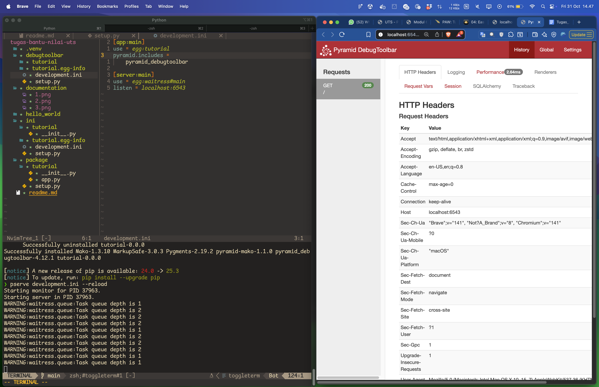

# Dokumentasi Project Quick Start - Pyramid

Nama: Syuhada Rantisi

NIM: 122140092

Mata Kuliah: Pengembangan Aplikasi Web

Kelas: RB

-------------------

01: Single-File Web Applications

02: Python Packages for Pyramid Applications

03: Application Configuration with .ini Files

04: Easier Development with debugtoolbar

05: Unit Tests and pytest

06: Functional Testing with WebTest

07: Basic Web Handling With Views

08: HTML Generation With Templating

09: Organizing Views With View Classes

10: Handling Web Requests and Responses

11: Dispatching URLs To Views With Routing

12: Templating With jinja2

13: CSS/JS/Images Files With Static Assets

14: AJAX Development With JSON Renderers

15: More With View Classes

16: Collecting Application Info With Logging

17: Transient Data Using Sessions

18: Forms and Validation with Deform

19: Databases Using SQLAlchemy

20: Logins with authentication

21: Protecting Resources With Authorization

